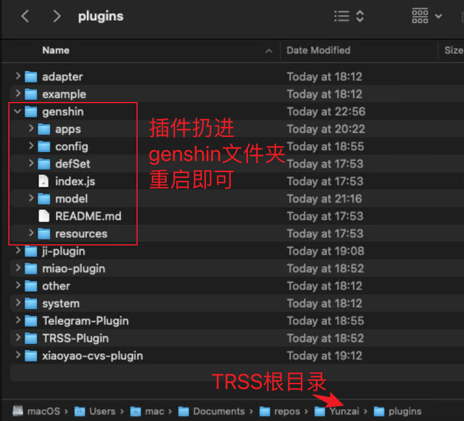

# 安装说明
将目录下全部文件放入 TRSS Yunzai 目录下，重启机器人即可。

交流群：

QQ: 491409784

✈️: [点此进群](t.me/neigui_impact)

# 警告⚠️
- 当前插件仅在 macOS 环境下测试过，其他平台的字体和渲染效果可能会有所区别。如果问题请开 issue 反馈。

- 当前插件为临时赶制版，缺失的功能会于近期慢慢更新上来，请保持更新。

- 查询七圣数据可能会出现验证码风控，请自行解决该问题。

# 可用命令说明
由于七圣命令被其他插件占用（七圣卡牌信息查看等），所以原本的七圣命令更改为 **#七圣战绩** **#七圣召唤战绩**

1. **#七圣战绩** **#七圣召唤战绩**
查看个人角色和行动卡牌数据，如使用次数、胜率等。

# 计划更新功能
以下是计划于近期新增的功能列表

1. #七圣牌组 #七圣卡组

    用于查看牌组及牌组详细信息。

2. #七圣排行 #七圣排名

    用于查看个人战绩排名（数据范围仅限使用过本插件提交过数据的用户，非全服）

3. #七圣大数据

    用于查看全部用户的卡牌总数据。

~~咕咕功能：卡组胜率统计、分版本卡牌数据统计、单卡战绩排名、人机推荐卡组、个人近期胜率走势及常用卡组~~

# 其他说明
- 开发者非专业从业人员，且精力有限，欢迎提出改进意见或参与开发